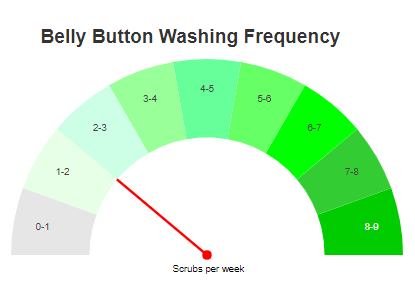

Belly Button Biodiversity

In this project is about building an [interactive dashboard](https://helenamin.github.io/Belly-Button-Biodiversity/) to explore the [Belly Button Biodiversity dataset](http://robdunnlab.com/projects/belly-button-biodiversity/), which catalogs the microbes that colonize human navels.

The dataset reveals that a small handful of microbial species (also called operational taxonomic units, or OTUs, in the study) were present in more than 70% of people, while the rest were relatively rare.

## Design 

For this purpose, D3 library is used to read in `samples.json`. and then these items added to the page:

1. A dropdown menu which filters each subject ID (person) in the page. 

2. A demographic information section which is designed to show the key-value pairs from the sample meta data of JSON object for each sunject ID(individual).

  

3. Horizontal bar chart to display the top 10 OTUs found in that individual and uses :
  * `sample_values` as the values
  * `otu_ids` as the labels
  * `otu_labels` as the hovertext

  

4. A bubble chart which uses:
  * `otu_ids` for the x values
  * `sample_values` for the y values
  * `sample_values` for the marker size
  * `otu_ids` for the marker colors
  * `otu_labels` for the text values

  

5. A donut chart with a needle which acts similar to a guage chart to display the weekly washing frequency of the individual.

  

By choosing a new sample from dropdown list, the demographic information section and all of the plots get updated.

This is how the dashboard looklike:

